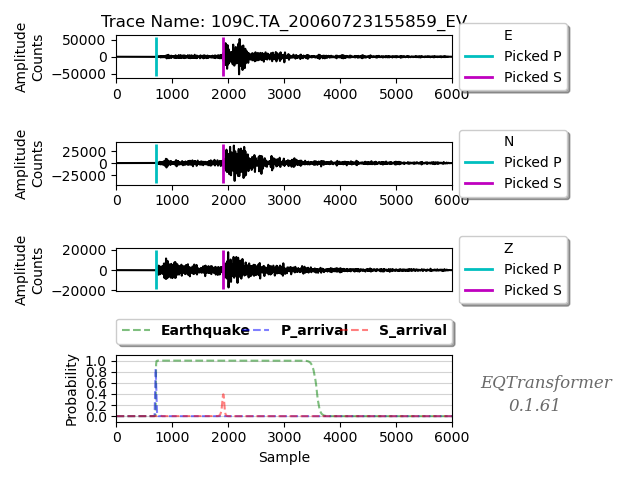
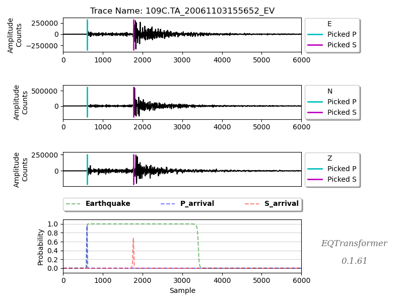
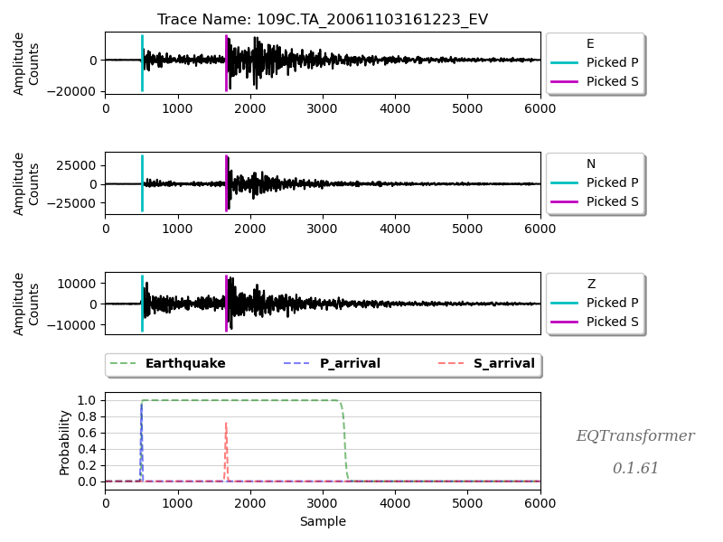

# EQTransformer — Baseline Test Run

**Project 26-2-R-3 · Compressing the Earthquake Transformer via Knowledge Distillation**
Braude College of Engineering
Students: Or Shterenshus, Shiraz Balmas · Advisors: Dr. Elena Kramer, Dr. Dan Lemberg

---

## Purpose

Before compressing EQTransformer with Knowledge Distillation, we first ran the **original
pretrained model** (our future "teacher") on labeled sample data to confirm it works and to
record a **baseline**. Every result the compressed "student" model produces later will be
compared against the numbers in this folder.

---

## The model under test

EQTransformer is a deep-learning model that performs two tasks at once on a 60-second,
three-channel seismic recording:

1. **Detection** — is there an earthquake in this window?
2. **Phase picking** — the exact arrival times of the **P-wave** and **S-wave**.

| Property | Value |
|---|---|
| Parameters | **373,495** |
| Model file size | ~4.9 MB (`.h5` on disk) |
| Weights-only memory | ~1.4 MB (float32) |
| Input shape | 6000 samples × 3 channels (E, N, Z) |
| Output | 3 probability curves: detection, P-pick, S-pick |

---

## What we ran

- **Input:** 100 labeled earthquake waveforms from the **STEAD** dataset (`input_data/`)
- **Model:** `EqT_original_model.h5` (`model/`)
- **Detection threshold:** 0.3 (P and S thresholds also 0.3)
- **Normalization:** standard (zero mean, unit variance per channel)
- **Runtime:** ~12 seconds for all 100 waveforms

> All 100 samples are labeled `earthquake_local`, so this run measures **recall**
> (how many real earthquakes were caught), not false-alarm rate. Measuring precision
> requires noise samples, which are available in the full STEAD dataset.

---

## Results

### Headline

| Metric | Result |
|---|---|
| **Earthquakes detected** | **99 / 100** (99% recall) |
| Mean detection probability | **0.988** (min 0.96, max 1.00) |
| Mean P-pick probability | **0.920** (min 0.48, max 0.96) |
| Mean S-pick probability | **0.681** (min 0.32, max 0.83) |
| Mean P-wave SNR | 20.9 dB |
| Mean S-wave SNR | 15.5 dB |

The model is highly confident on detection (~0.99) and on P-picks (~0.92). S-picks are
lower-confidence (~0.68), which is expected: the S-wave arrives into an already-shaking
signal, making it harder to pick than the P-wave, which arrives into quiet background noise.

The single missed event was trace `109C.TA_20070912081130_EV` — a real earthquake whose
detection probability fell below the 0.3 threshold (a **false negative / miss**).

### Example detections (first 5 of 99)

| Trace | Detection prob. | P prob. | S prob. |
|---|---|---|---|
| 109C.TA_20060723155859_EV | 0.99 | 0.85 | 0.39 |
| 109C.TA_20061103155652_EV | 0.99 | 0.96 | 0.68 |
| 109C.TA_20061103161223_EV | 0.99 | 0.94 | 0.72 |
| 109C.TA_20061114133221_EV | 0.99 | 0.94 | 0.69 |
| 109C.TA_20061127104640_EV | 0.98 | 0.88 | 0.34 |

Full results for all 99 events are in [`results/X_prediction_results.csv`](results/X_prediction_results.csv).

---

## Detection plots

Each plot shows one detected earthquake. The **top three panels** are the raw E / N / Z
waveforms with the picked **P-arrival (cyan)** and **S-arrival (magenta)** marked. The
**bottom panel** shows the model's output probability curves: **detection (green)**,
**P-pick (blue)**, and **S-pick (red)**.

### Example 1 — `109C.TA_20060723155859_EV`


### Example 2 — `109C.TA_20061103155652_EV`


### Example 3 — `109C.TA_20061103161223_EV`


How to read a plot: the ground is quiet, then the **P-wave** arrives (cyan line, smaller
motion), then the **S-wave** arrives (magenta line, larger motion). In the bottom panel the
green detection curve rises to ~1.0 and stays high for the earthquake's duration, while the
blue and red curves spike sharply at the P and S arrival times.

---

## How to run it yourself

### Prerequisites
- A conda environment named `eqt` with **Python 3.9, TensorFlow 2.11, ObsPy, NumPy < 2.0**
- The EQTransformer package installed (`pip install -e .` from the cloned repo)

### Option A — run the notebook (recommended)
1. Launch Jupyter using the `eqt` environment (e.g. via `launch_eqtransformer.bat`).
2. Open [`RUN_ME_FIRST_demo.ipynb`](RUN_ME_FIRST_demo.ipynb).
3. Set the kernel to **EQTransformer (Python 3.9)** (Kernel → Change Kernel).
4. Run all cells top to bottom. The notebook checks the environment, explores the data,
   plots a raw waveform, runs detection, and displays the results and plots.

### Option B — run detection directly in Python
```python
from EQTransformer.core.predictor import predictor

predictor(
    input_dir  = "input_data",              # folder with 100samples.hdf5 + .csv
    input_model= "model/EqT_original_model.h5",
    output_dir = "results",
    detection_threshold = 0.3,
    P_threshold = 0.3,
    S_threshold = 0.3,
    number_of_plots = 3,
    batch_size = 100,
    normalization_mode = "std",
)
```

> `predictor()` scans `input_dir` and expects each station to have a matching
> `name.hdf5` **and** `name.csv`. Keep only the data files in that folder — model `.h5`
> files placed alongside the data will cause an error.

The run parameters we used are recorded in [`results/X_report.txt`](results/X_report.txt).

---

## Folder contents

```
EQTransformer test run/
├── README.md                     ← this file
├── RUN_ME_FIRST_demo.ipynb       ← the notebook that runs the test (with inline plots)
├── input_data/
│   ├── 100samples.hdf5           ← 100 input waveforms
│   └── 100samples.csv            ← metadata + ground-truth P/S labels
├── model/
│   └── EqT_original_model.h5     ← the pretrained teacher model (373,495 params)
└── results/
    ├── X_prediction_results.csv  ← all 99 detected events
    ├── X_report.txt              ← run parameters + summary
    └── figures/                  ← 3 detection plots
```

---

## Baseline for later comparison (Phase B)

| Metric | Teacher (this run) | Student (target) |
|---|---|---|
| Parameters | 373,495 | ≤ 50% of teacher |
| Detection recall | 99 / 100 | ≥ 95% retained |
| Inference cost | baseline | significantly lower |

These numbers are the reference point for evaluating the compressed student model.
